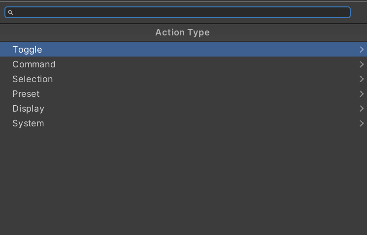

# Actions Overview

Buttons can be configured to do any number of actions. Toggle actions
are stateful, with on/off states, while Command actions perform an
action without tracking an on/off state. Selection actions allow making
color selectors, and preset actions are for the presets system. Display
actions display a value on the button, and System actions handle Enigma
OS functions like navigation.

Toggle Actions:

Toggle Autochange Group: This toggles auto-changing on/off for the
specified auto-changing group. See [Advanced Features](advanced.md).

Toggle Material: This swaps the material on the specified renderer. If
multiple materials exist on the renderer, a material index field will be
shown. The default field controls which material is applied on
deactivation, and is auto-populated from the renderer’s current material
when the field is empty.

Toggle Object: This toggles the active state of the specified
GameObject. On activation the GameObject is enabled, and on deactivation
it’s disabled.

Toggle Shader: This toggles the active state of a Screen Shader template
instance, used for the multiple-material screen shader approach where
each button activates a different shader. See [Screen Shader Setup](screen-shaders.md).

Toggle Shader Keyword: This enables the specified shader keyword on the
chosen renderer’s material on activation, and disables it on
deactivation. Most shader sets manage keywords automatically through
their property toggles, so you usually don’t need this action for the
officially supported shader sets.

Toggle Shader Property: This sets a shader property on the specified
renderer’s material to the active value, and reverts it to the default
value on deactivation. Supports Float, Color, and Vector property types.
The “Also Set Effect Toggle” option auto-enables the effect’s master
toggle keyword, which is required for most screen shader sets. Use the
Search button to pick a property from the assigned material.

Toggle Skybox: This swaps the scene’s skybox to the specified material
on activation, and reverts to the scene’s starting skybox on
deactivation. See the Skybox Folder template for an example.

Toggle Transform: This swaps the position, rotation, and/or scale of the
specified Transform between an active and default state. Each axis can
be enabled independently, and the action can target world or local
space.

Toggle Udon Variable: This sets a public field on the specified
UdonSharpBehaviour to the active value on activation, and to the default
value on deactivation. Supports Float, Bool, Int, and String variable
types. Use the Search button to pick a variable from the target
behaviour.

Command Actions:

Apply Material: This applies the specified material to the renderer slot
on press. Unlike Toggle Material, there is no off state — the swap is
one-shot and persists until something else changes the material.

Apply Skybox: This swaps the scene’s skybox to the specified material on
press. Like Apply Material, the swap is one-shot with no automatic
restore.

Set Autochange Group State: This forces the specified auto-changing
group on or off on press. Unlike Toggle Autochange Group, this always
sets the state to a fixed value rather than flipping between on and off.

Set Object State: This forces a GameObject to a specific active state on
press. Useful for “always-on” or “always-off” buttons.

Set Shader Keyword: This forces a shader keyword to a specific state on
press. The target state determines whether the keyword is enabled or
disabled.

Set Shader Property: This writes a value to a shader property on press.
With “Use Step” enabled, the value increments by the configured Step
Amount on each press, optionally wrapping or clamping at the configured
min/max bounds — useful for cycling through discrete property values
like the AudioLink band selectors in the included templates.

Set Transform: This sets a Transform’s position, rotation, and/or scale
to a fixed value on press. Each axis can be enabled independently, and
the action can target world or local space.

Set Udon Variable: This writes a fixed value to a public field on the
specified UdonSharpBehaviour on press. Supports Float, Bool, Int, and
String variable types. With “Use Step” enabled, the value steps each
press like Set Shader Property.

Teleport Object: This teleports a GameObject to the specified
destination Transform on press. Position and optionally rotation are
copied from the destination.

Teleport Player: This teleports the local player to the specified
destination Transform on press. Position and optionally rotation are
applied to the player.

Trigger Udon Event: This calls a public method on the specified
UdonSharpBehaviour on press. Use the Search button to pick from the
target’s available public methods.

Selection Actions:

Next Color: Within a Color Palette, this advances the pending color to
the next palette entry on press. Pair with a Set Color button using the
same Color Palette Name to apply the pending color to a target.

Next Variant: Within a Variant Group, this advances the pending variant
to the next item on press. Pair with a Set Variant button using the same
Variant Group Name to apply the pending variant.

Previous Color: Like Next Color, but moves backward through the palette.

Previous Variant: Like Next Variant, but moves backward through the
variant list.

Set Color: Owns the color palette and applies the pending color to the
target renderer on press. Configure the palette colors directly on this
action.

Set Variant: Owns the variant list and applies the pending variant on
press. Each variant maps to a different value on a configured shader
property.

Preset Actions:\
See [Using Presets](presets.md).

Display Actions:

Display Autochange Group: Displays the current state of the named
auto-changing group on the button label. Read-only — pressing does
nothing.

Display Color Palette: Displays the currently applied color from a Color
Palette as the button’s tint. Pair with a Set Color action elsewhere
using the same Color Palette Name.

Display Controller: Displays a value sourced from the controller itself,
such as the current folder name. Read-only.

Display Shader Property: Reads a shader property from a material and
displays its current value on the button label. Useful for showing the
current value of a property driven by other buttons or faders.

Display Stat: Displays a VRChat world stat (visit count, favorite count,
etc.) on the button label. Some metrics require the world’s API URL to
be configured. Read-only.

Display Udon Variable: Reads a public variable on a UdonSharpBehaviour
and displays its current value on the button label. Use the Search
button to pick the variable from the target.

Display Variant Group: Displays the currently applied variant name from
a Variant Group on the button label. Pair with a Set Variant entry using
the same Variant Group Name.

System Actions:

Display Folder Name: Displays the current folder’s name on the button
label. Read-only.

Display Page Number: Displays the current page number on the button
label. Read-only.

Go To Fader Page: Navigates to the specified fader page on press. See
[Using Faders](faders.md).

Go To Folder: Navigates to the specified folder on press.

Go To Page: Navigates to the specified page index within the current
folder on press.

Next Fader Page: Advances to the next fader page on press. See [Using Faders](faders.md).

Next Folder: Advances to the next folder on press.

Next Page: Advances to the next page in the current folder on press.

Previous Fader Page: Goes back to the previous fader page on press.

Previous Folder: Goes back to the previous folder on press.

Previous Page: Goes back to the previous page in the current folder on
press.

Reset: Resets all entry states to their on-by-default values, all step
values to defaults, and all color/variant selections to defaults. Useful
for a “reset all” button.

Set Fader Mode: Switches between hand-collider and VRC pickup control
modes for fader manipulation. Useful for desktop users or anyone who
prefers grabbing faders rather than sliding them with hand colliders.

Set Whitelist: Forces the controller’s whitelist on or off on press.
Whitelist must be enabled in the EnigmaController inspector for this
action to function. See [Whitelist (Access Control)](whitelist.md).

Toggle Whitelist: Toggles the controller’s whitelist between two states.
The Default field is the value the whitelist returns to when the button
deactivates; the active state writes the inverse. Whitelist must be
enabled in the EnigmaController inspector for this action to function.
See [Whitelist (Access Control)](whitelist.md).

---

**Navigation:** [Introduction](index.md) · [Installation](installation.md) · [Using Enigma OS](using-enigma-os.md) · [Using Prefabs](using-prefabs.md) · [Template System](templates.md) · [Screen Shader Setup](screen-shaders.md) · [Actions Overview](actions.md) · [Using Faders](faders.md) · [Using Presets](presets.md) · [Advanced Features](advanced.md) · [Whitelist (Access Control)](whitelist.md) · [Standalone Buttons](standalone-buttons.md) · [Custom Controllers](custom-controllers.md)

[← Screen Shader Setup](screen-shaders.md) | [Using Faders →](faders.md)
