# Advanced Features

### Step Buttons

Step buttons allow you to increment a value by a specified amount within
a specified range, optionally with wrapping. This allows one button to
set many states instead of just one, useful for applications like an
AudioLink band button, or - / + buttons. Examples of these are in the
templates.

To make a step button, add either the “Set Shader Property” or “Set Udon
Variable” action to a button, and then enable “Use Step”. In the below
example, I’ve configured Brightness to increment by 0.1 on each press,
up to a maximum of 2. The “-“ button has the same configuration, but
with a step amount of -0.1.

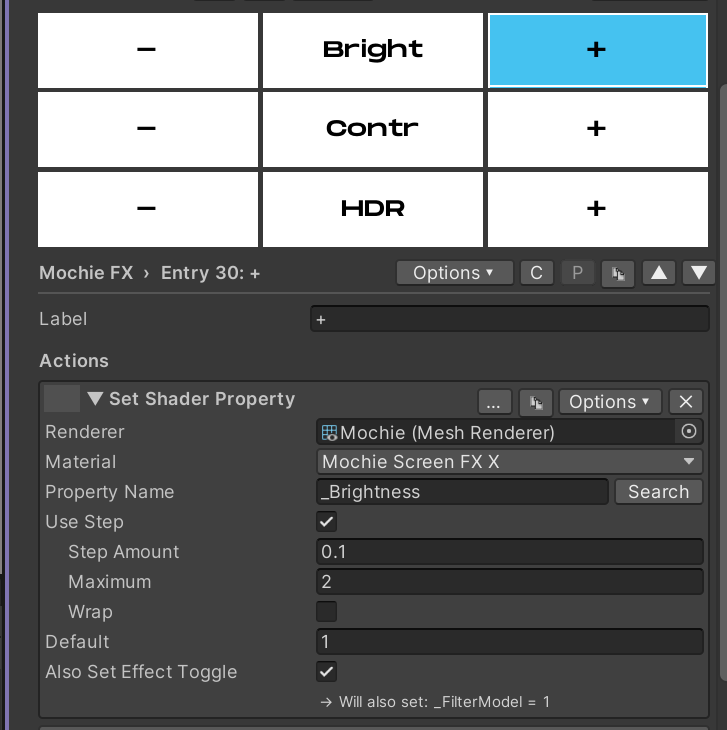

The button in the middle uses a Display action and Custom Color to
display the value and provide visual feedback for the step buttons. See
[Display Actions and Custom Colors](advanced.md#custom-colors-and-display-actions).

### Custom Colors and Display Actions

The “Custom Color” in the Options menu of each button lets you choose
what color the button indicator shows, instead of the button using the
default colors in the Settings foldout. Optionally, you can also enable
“Conditional” to have the color be controlled by the value of a shader
property or udon variable.

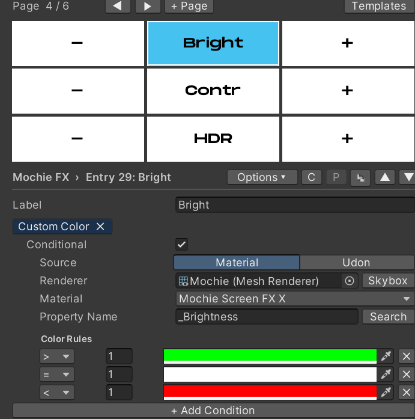

In this example, the button is white (default inactive color) when the
value is 0, green when the value is positive, and red when the value is
negative.

Using this same method, we can also use Custom Color for an AudioLink
band button. Keep in mind that the bands are dependent on the shader
(0-3 for Mochie FX, 1-4 for Bean FX)\
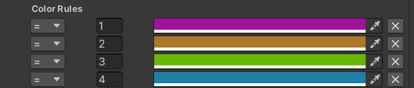

Display actions display a value on the second line of the button that
has the action. For example, I am using a “Display Shader Property”
action to display the value that is controlled by the step buttons on
either side of the “Bright” button.

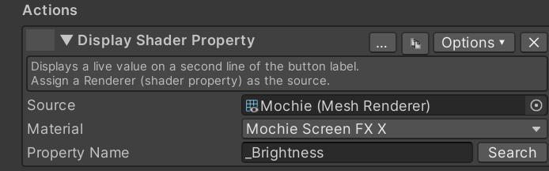

### Color Palettes

Color Palettes allow you to define a set of colors, and then choose
which color to apply. For example, in the Mochie FX template we
accomplish this using three buttons: Cur Color, Set Color and Nxt Color.

The Set Color action defines the Color Palette. Here you define a name
for the color palette and the colors in the palette. All three buttons
for the palette use this same name, allowing you to make more than one
color palette. The pending color is shown on this button, and on press
it sets the color on the target shader property.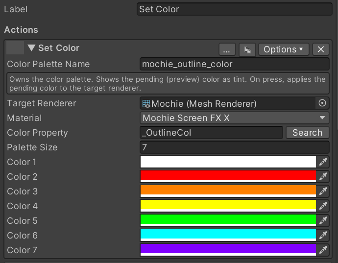

The Next Color action lets you cycle through the colors, changing the
pending color. This lets you choose what color you want to apply, then
you press the Set Color button to apply it.

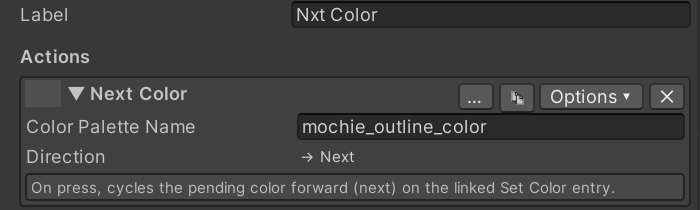

The Cur Color button in my example simply displays the active color. The
active color is what the shader is set to, not the pending color on the
Set Color button.\
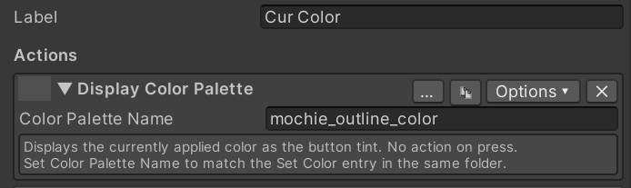

There is also a Previous Color action if desired.

### Exclusivity

Exclusivity allows toggling on a button to disable other buttons with
the same exclusive group. This system is inspired by and works similar
to VRCFury exclusive tags. This is useful in a number of applications,
such as effects that can not both be enabled at the same time.\
\
An example of this is in the Mochie FX template for the Aura Outline and
Sobel Outline buttons. To enable exclusivity, enable “Use Exclusive
Tags” in the Options menu of the button. An “Exclusive Tags” tag should
appear.

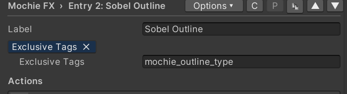

In this example, both Aura Outline and Sobel Outline share the tag
“mochie_outline_type”. A button can belong to more than one exclusive
group, enter exclusive tags comma delimited. Enabling one of these
buttons then disables the other. Only one button in an exclusive group
can be enabled at a time. However, all buttons in an exclusive group can
be disabled.

If you want one button within a group to always be enabled, such as a
group of toggle material action buttons, you can also enable “Exclusive
Off” in the Options menu. Whichever button has this tag will be enabled
when a button in the exclusive group is disabled. There is also a “Make
Folder Exclusive” and “Clear Exclusivity” option to quickly set an
entire folder to be exclusive, useful for applications like a Skybox
folder.

### Variant Groups

Variant Groups work similar to Color Palettes, but instead of defining a
set of colors, you can define a set of values. This lets you configure a
selector for a set of values and choose which to apply, instead of
stepping through values with a step button. Additionally, variant groups
support textures. This is useful for defining a set of textures for
effects like overlays and triplanar effects, which is impossible to do
through step actions.\
\
See [Color Palettes](advanced.md#color-palettes) for setting this up, the setup is fundamentally
the same.

Variant Groups have not been extensively tested yet, so use at your own
risk.

### Auto-Changing

Auto-Changing allows Enigma OS to cycle between buttons on a specified
interval. An example of this is in the Skybox template.

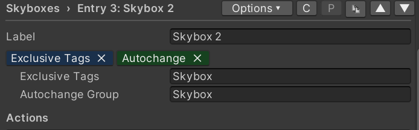

Enter a name for the Autochange group. All buttons you want to be
autochanged should share this group name.

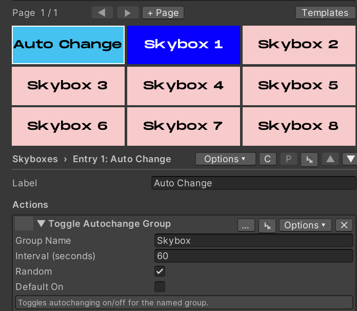

On a separate button, add a “Toggle Autochange Group” action. This
action enables or disables auto-changing for the specified group. Set
the desired change interval, and whether the auto-changing should be on
by default when the controller is initialized. The “Random” checkbox
controls if auto-changing picks a random button (besides the currently
active one), or if it goes in order as configured in the controller
(Skybox 1 -\> Skybox 2 -\> Skybox 3 for example).

You can make any number of auto-change groups as you desire, just make
sure you have separate toggle autochange buttons to control them. Unlike
exclusive groups, a button can only be assigned to a single auto-change
group.

### Expire / Delay / Conditions

You can configure a button to expire after a certain amount of time.
Enable “Expire” in the button’s Options menu. After activating the
button, Enigma OS will wait that amount of time and then disable the
button.

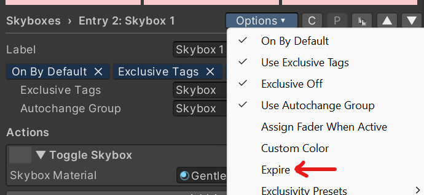

Actions can also be configured to have a delay before they are executed.
Each action can have a separate delay, allowing staggered action
execution. Optionally you can also have it delay deactivation as well.
Enable the “Delay” option in the action’s Options menu and set the wait
time in seconds.

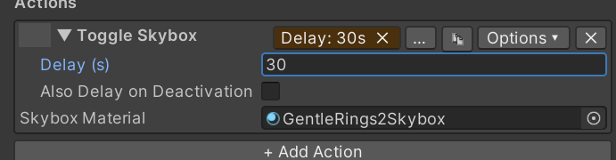

You can also set an action to only execute if a condition is true. This
is really just a proof of concept right now. Currently, the only
condition possible is the active state of another configured button on
the controller. If you have a use case for other conditions, submit a
suggestion in the Discord and I can add it.

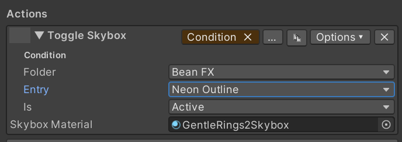

### Using Multiple Enigma OS controllers

Enigma OS supports using multiple controller prefabs in the same scene.
If you’re using multiple controllers for separate purposes, you do not
need any additional setup.\
\
If you want to use two or more controllers for the same purpose, for
example screen shaders in separate areas of your world, or separate
skyboxes in different areas, then you need to add the “Enigma Controller
Boundary” script to a gameobject with a trigger collider, sized around
the area that the controller should be active in. This script re-syncs
the visual state when the local player enters that area and disables
controllers in other areas so the player only receives actions from the
controller in the area of the world they are currently in. You can
optionally disable the disabling behavior.

[← Using Presets](presets.md) | [Whitelist (Access Control) →](whitelist.md)
