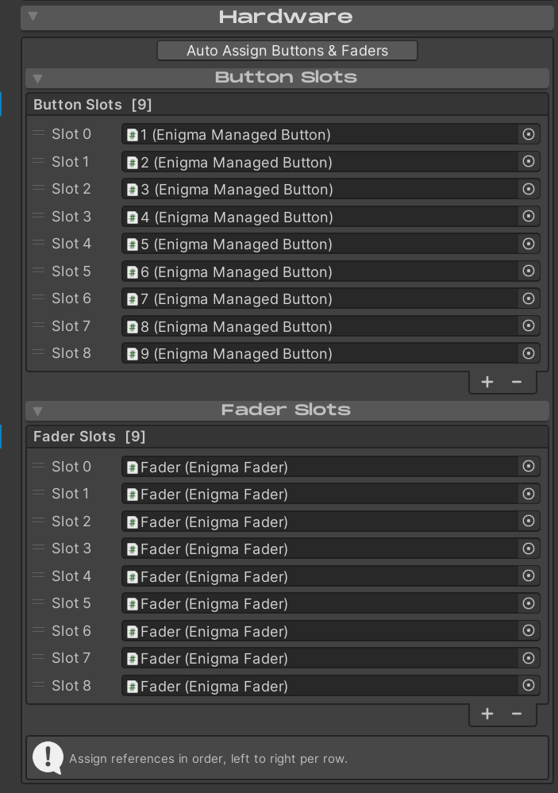
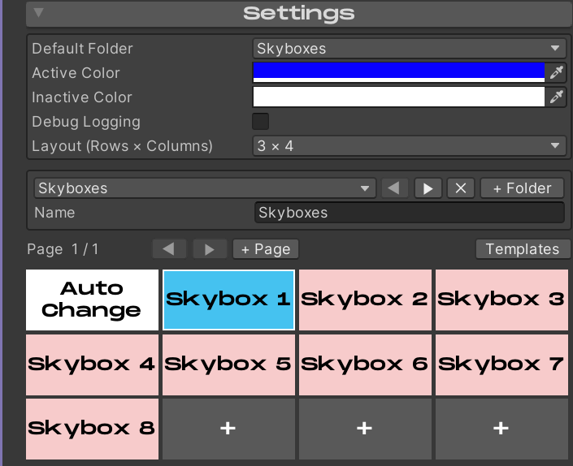

# Custom Controllers

You are more than welcome to design your own controllers or modify the
included prefabs!

Enigma OS supports any number of buttons / faders. Assign these in the
Hardware foldout. You can click “Auto-Assign Buttons & Faders” to
quickly assign all buttons/faders nested under the Buttons and Faders
child objects. You should assign these in order as they are physically
in the scene, top-to-bottom, left-to-right per row.

You can adjust the Button Grid in the Enigma OS editor to match the
physical layout you create by using the Layout dropdown in the Settings
foldout. In this example, I am using 12 buttons with 3 rows of 4
buttons.

[← Standalone Buttons](standalone-buttons.md)
