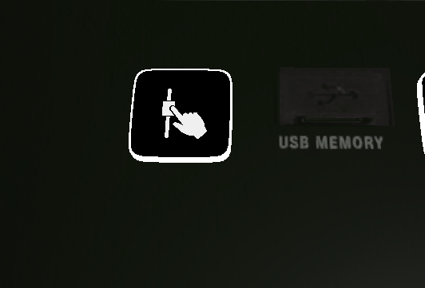
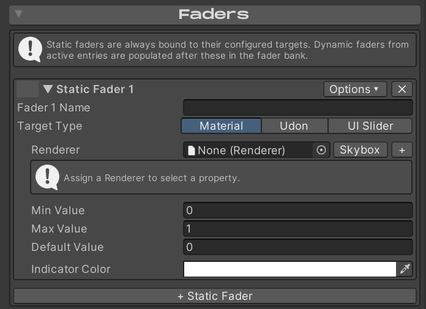
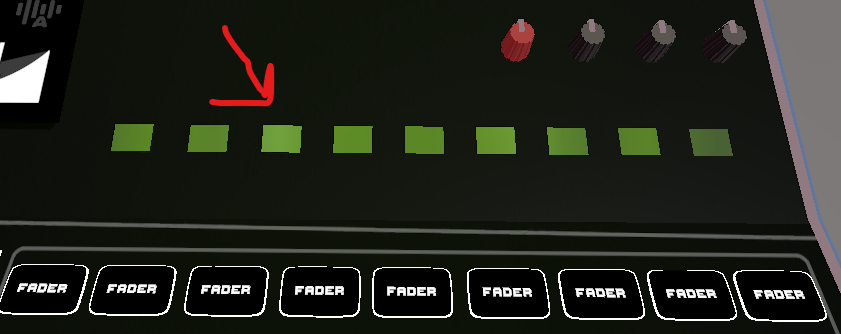
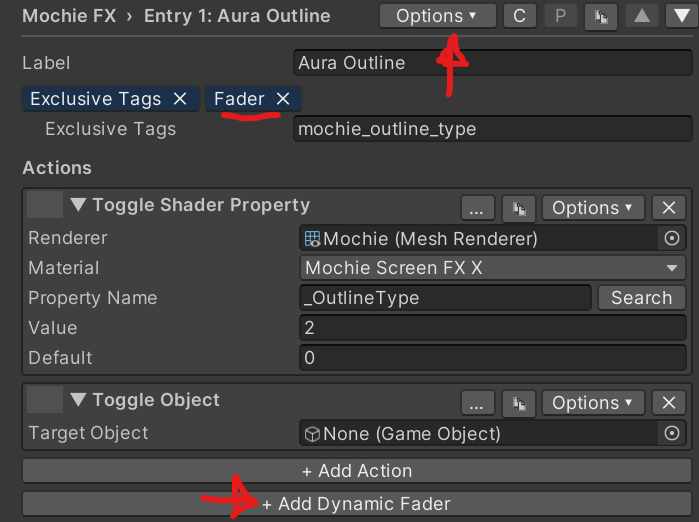
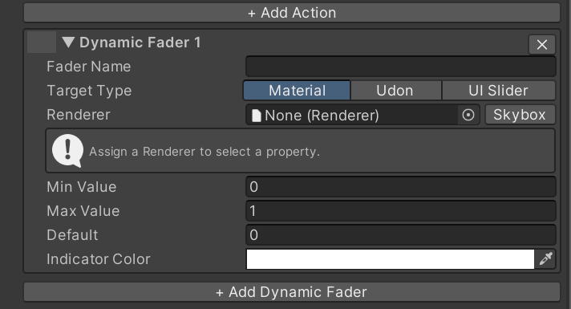
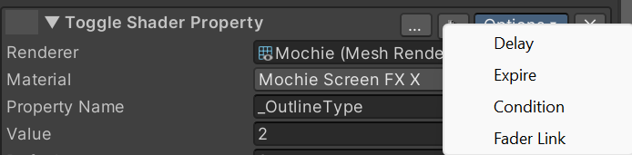
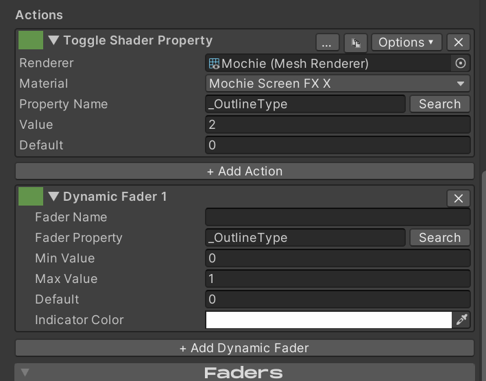

# Using Faders

There are two types of faders within Enigma OS, static faders and
dynamic faders. Think of each fader on the Mixer prefab as a “slot”.
Static faders are assigned to a slot permanently, while dynamic faders
are only assigned to a slot when their associated button is enabled.
Faders can control both float values and color values (hue shift), and
can target shader properties (Material), Udon variables (Udon) or UI
Slider components. You can also optionally target the scene skybox.

Faders can be controlled either by hand colliders (the tip of the index
finger on each hand), or by normal VRC Pickup, allowing manipulation in
the editor and in Desktop mode. The “Set Fader Mode” action controls
this.

To assign a static fader, use the Faders foldout. The “+” button allows
targeting multiple renderers or udon behaviors, letting a single fader
control multiple VRSL lights for example.

Min Value is the bottom position of the fader, while Max value is the
top position of the fader. Max Value does not need to be greater than
the Min Value. Default Value is the position the fader starts at when
assigned.

If at any point you have more faders assigned than available slots, use
the fader paging buttons to switch pages. Enigma OS includes several
actions for fader navigation, so you can switch these to a previous /
next fader page button if you prefer, letting you use the rest of the
buttons as hotkeys for whatever actions you desire.

In the Options menu you can set “Always Visible” on a fader to pin that
fader to stay visible across all fader pages. Keep in mind that this
reduces the total number of assignable slots, if you set all 9 static
faders to “Always Visible”, there will be no remaining slots for dynamic
faders to be assigned.

To configure dynamic faders, enable “Assign Fader When Active” in the
Options menu of a button. You should see the “Fader” tag appear, and a
new button “+ Add Dynamic Fader”.

Clicking that button makes a dynamic fader that gets assigned when that
button is in the “on” state. A button can assign multiple dynamic
faders.

You can also make a dynamic fader by clicking “Options” on an action
within a button and clicking “Fader Link”.

The benefit to this is that the newly created dynamic fader will inherit
the renderer set in the action, saving time. If you change the renderer
in the action, it will also change it in the linked fader. You can tell
which faders are linked to which action as they will share a unique
color in the drag box (green in the example below).

Dynamic faders will remember their positions when re-assigned. So if you
disable a button and then enable it again, the position will snap to the
position it was before being deactivated, not the default position.

Static faders are always assigned to the first slots on the controller,
then any active dynamic faders.

### Targeting VRSL Lights

VRSL stage lights drive their color through a Udon variable, not a
material property. The fixture’s script writes \_Emission to its meshes
every frame, so a fader that targets the material directly gets
overwritten right away. Use the Udon path instead.

In the Faders foldout, drop the VRSL fixture’s root GameObject into the
Behaviour field, set the Property Type to Color, and set the Udon
Variable Name to lightColorTint. The “+” button lets you add more
fixtures to the same fader to drive a whole rig.

The same setup works for the VRSL GI variants — no extra configuration
needed for the GI bounce color to follow.

---

**Navigation:** [Introduction](index.md) · [Installation](installation.md) · [Using Enigma OS](using-enigma-os.md) · [Using Prefabs](using-prefabs.md) · [Template System](templates.md) · [Screen Shader Setup](screen-shaders.md) · [Actions Overview](actions.md) · [Using Faders](faders.md) · [Using Presets](presets.md) · [Advanced Features](advanced.md) · [Whitelist (Access Control)](whitelist.md) · [Standalone Buttons](standalone-buttons.md) · [Custom Controllers](custom-controllers.md)

[← Actions Overview](actions.md) | [Using Presets →](presets.md)
