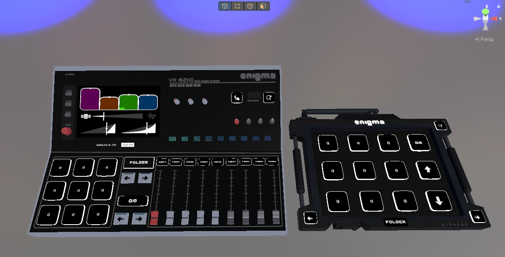

# Introduction

Enigma OS is a fully-configurable in-world control surface for VRChat
worlds. It pairs the look and feel of a hardware MIDI launchpad or DJ
mixer with a flexible action system that lets you wire up nearly any
in-world behaviour — material swaps, screen shader effects, skybox
changes, AudioLink modulation, GameObject toggles, Udon variable writes,
transform changes, teleports, and more — all without writing a single
line of code. Configuration happens entirely through the Unity
inspector: you build folders of buttons, drop actions onto each one from
a categorized picker, and Enigma OS bakes everything down to runtime
arrays consumed by a single Udon executor at play time.

Out of the box, Enigma OS ships with two ready-to-use prefabs (a
button-only Launchpad and a fader-equipped Mixer with a built-in
AudioLink controller and screen display), a library of templates
covering common patterns (object toggles, material swaps, skybox
switchers, world-stat displays, persistent presets, and turnkey folders
for popular shader sets), and integrated support for popular third-party
systems (OhGeezCmon Access Control, ProTV, Flatline). Advanced features
include exclusivity tags, time-based auto-changing, conditional and
stepped actions, color palettes, persistent per-user preset storage via
VRChat PlayerData, dynamic faders that re-bind based on which buttons
are active, and multi-controller support with room boundaries for
spatially-separated installs. The result is a single asset that scales
from a one-button toggle to a full mixer-style FX rig.

The Mixer prefab’s design is inspired by the Roland VR-50HD AV Mixer.

[Installation →](installation.md)
