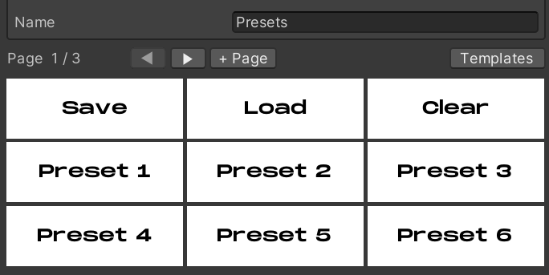
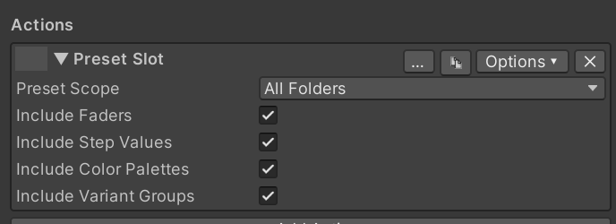

# Using Presets

Presets allow you to “snapshot” the current state of the controller
in-game, and save that as a preset. Clicking that preset then sets that
state, allowing you to launch multiple effects with one press. Presets
save to persistent player data, allowing you to use the presets across
all instances of that world. Whatever set of presets are loaded on the
controller show for all users, these are not local. This lets you share
presets with others, though if they click Save they will overwrite any
previously saved presets with the currently loaded set. Each operator
can save and load their own set of presets.

\
\
You can use the Presets template to quickly make a Presets folder with
all of the necessary actions. It includes 24 preset slots by default.

The available preset actions are:

Preset Slot: Represents a single preset slot. The Presets Folder
template includes 24 of these. Press an empty slot to capture the
controller’s current state into it. Press a filled slot to recall its
saved state. Press a slot while Clear Presets is active to clear that
one slot. Slot data is network-synced across users in the world
instance, but only persists across sessions when Save Presets is pressed
(see below).\
\
Clear Presets: This toggles a clear mode on the controller. While clear
mode is active, the next Preset Slot press clears that one slot (clear
mode then resets automatically). Press Clear Presets again to cancel
without clearing. See [Using Presets](presets.md).

Save Presets: This persists all populated preset slots to your VRChat
PlayerData (per-user). Without pressing this, slot data only lives in
the controller’s runtime memory and is lost when you leave the world.
Pressing Load Presets in a future session restores everything. See
[Using Presets](presets.md).

Load Presets: This restores all preset slots from your PlayerData,
overwriting whatever’s currently in the controller’s slots. If the
controller’s layout has changed since the presets were saved, an
“Incompatible Layout” warning appears on the button instead.

Within each Preset Slot action, you can configure which folders should
be included in the snapshot, and optionally whether fader positions and
color palette selections / variants are included. Buttons with preset
actions are excluded from snapshotting.

You should avoid using the “Load” button more than necessary, as this
action syncs the large presets from your player data to ALL clients.
This sync only happens once on load so it’s not that big of an issue,
but it’s something to keep in mind.

---

**Navigation:** [Introduction](index.md) · [Installation](installation.md) · [Using Enigma OS](using-enigma-os.md) · [Using Prefabs](using-prefabs.md) · [Template System](templates.md) · [Screen Shader Setup](screen-shaders.md) · [Actions Overview](actions.md) · [Using Faders](faders.md) · [Using Presets](presets.md) · [Advanced Features](advanced.md) · [Whitelist (Access Control)](whitelist.md) · [Standalone Buttons](standalone-buttons.md) · [Custom Controllers](custom-controllers.md)

[← Using Faders](faders.md) | [Advanced Features →](advanced.md)
