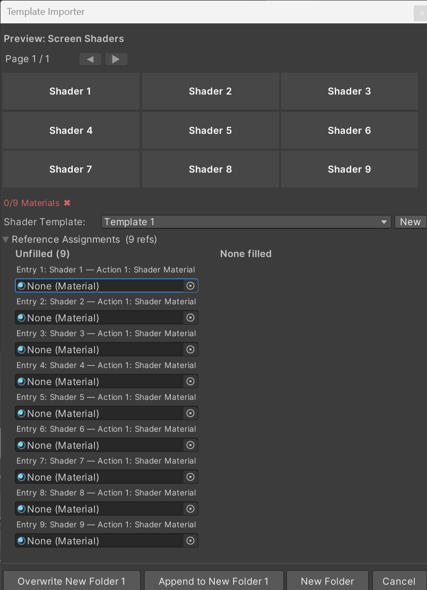
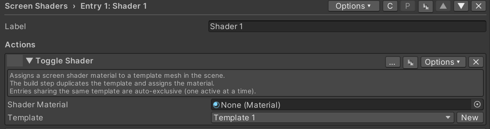
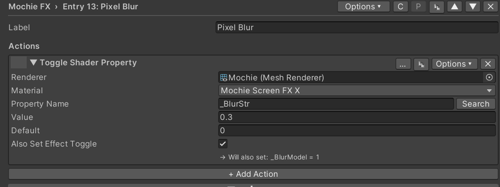
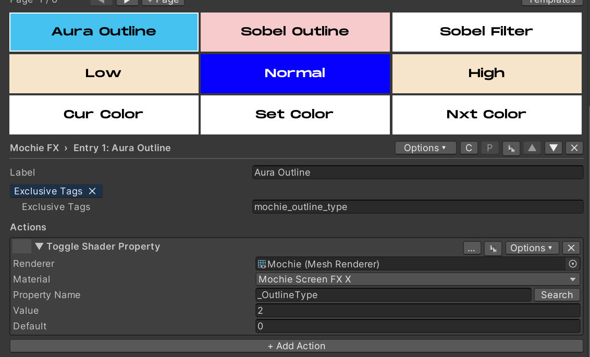

# Screen Shader Setup

There are two ways to go about using screen shaders with Enigma OS,
using one material/renderer or using multiple materials and a templated
renderer.

Multiple Material Setup

If you already have a collection of materials with separate effects
configured on each material, you can use the multiple materials
approach, which uses the “Toggle Shader” action. The easiest way to do
this is to import the “Screen Shaders” template.

Assign each screen shader material in Reference Assignments. If you have
more, import again and choose the Append option to add another page, or
simply duplicate the button in the button grid. Click the “New” button
to add a shader renderer to the scene. This is an editor-only cube with
no collider. Size the cube around the area you want effects to be
visible. Enigma OS will handle duplicating this template for each
material, and each button toggles the active state of the duplicated
renderer. If you’re using more than one controller or have multiple
rooms that you want separate effects in, you can make separate
templates. Choose the right one in the template dropdown of the
importer, or in the “Toggle Shader” action.

Single Material Setup

You can also control screen shaders using just a single material /
renderer. This is the approach used by the shader set templates. For
quick setup, import the template for the shader set you want to use. See
[Template System](templates.md). The renderer you choose should be a cube (or
sphere, but cube is recommended) and should be sized around the area you
want the effects to render in. Remember to remove the default collider
from this object. Assign a material using the chosen shader set to that
renderer. You do not need to enable the effects manually within the
material or lock the material! Enigma OS handles configuring the
material and locking it based on what is configured in the Enigma OS
editor.

To make your own folder using the single material approach, add a
“Toggle Shader Property” action on any button, and assign your renderer.
Then, choose which property you want the button to toggle.

The value field is the value that property will be set to when the
button is toggled. The default field is the “off” state of the toggle,
and will be set on scene start.

You can also customize your shader folder even more, with exclusivity,
auto-changing, value displays, step buttons, color selectors, delays,
trigger conditions, and custom button colors. See [Advanced Features](advanced.md)
to learn how to use these, or take a look at the shader set templates
for examples.

You can also have buttons assign faders to the fader bank when enabled,
see [Using Faders](faders.md).

Additional Notes:

You should place your templates/renderers under a parent object called
“Shaders” or something similar, then place a user-facing toggle in your
world to disable/enable that parent object locally. This allows players
to turn on/off the screen effects for performance or sensitivity
reasons.

Enigma OS officially supports the following screen shader sets:

- Mochie Screen FX (both free and paid versions)

- June FX (both free and paid versions)

- Bean FX

- Taco FX

Other shader sets will work, but Enigma OS may silently skip locking or
keyword management if the shader structure differs from the patterns
established by these shader sets. If you find a shader set isn’t being
locked properly (effects don’t render in the published world), manually
lock the material before building. A “Toggle Shader Keyword” action is
included to allow setting shader keywords manually (this isn’t required
for the officially supported shader sets, Enigma OS manages keywords
automatically for any shader using the standard [Toggle(KEYWORD)]
attribute convention).

It’s recommended to use the single material approach for most setups.
This is more optimized in most cases, but whether or not that is the
case largely depends on the shader set and what effects you configure.
If you find using a single material is too unoptimized or you plan on
configuring a large number of effects using a shader set like June FX,
the multiple material approach may be more optimized, as the benefits of
using a single material/renderer become outweighed by a massive single
shader compiled with many heavy effects. Test in game before publishing.

If certain effects do not render, check that a material/renderer not
controlled by Enigma OS renders the effect. If not, the issue is not
with Enigma OS but your configuration or scene setup. Some shader
effects require Depth Lights, make sure you have one in your scene. You
do NOT need to add multiple depth lights to your scene if using multiple
shader sets, only one is required. They force Unity to
populate \_CameraDepthTexture, which is a global resource any
depth-reading shader can sample.

[← Template System](templates.md) | [Actions Overview →](actions.md)
