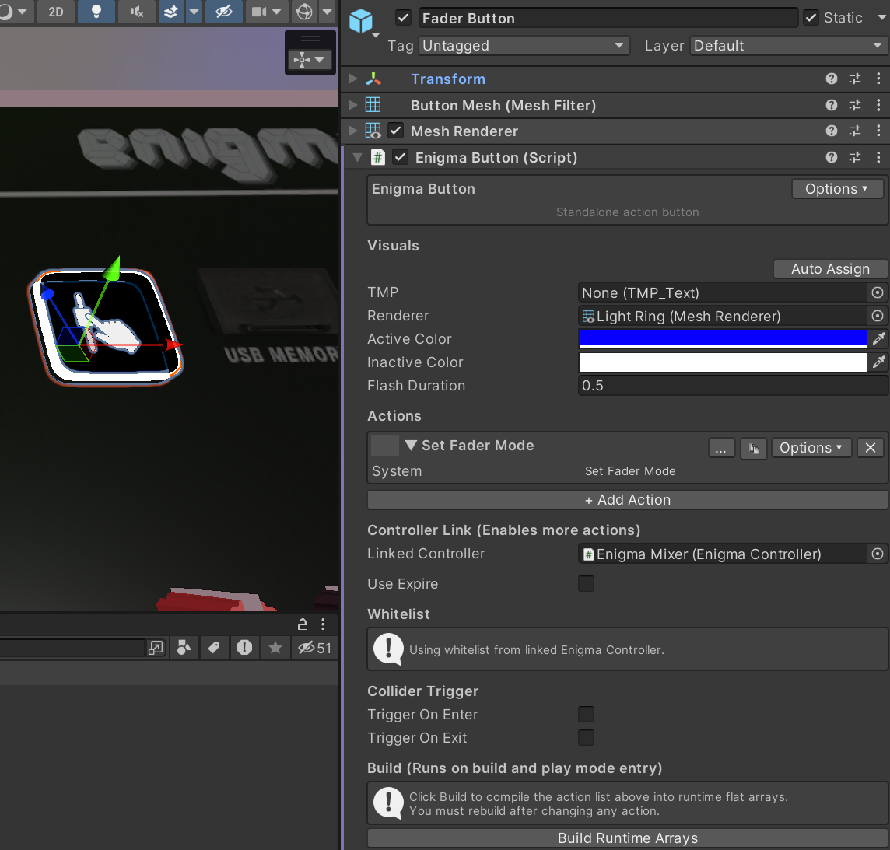

# Standalone Buttons

You can also use Enigma OS as an independent action executor, standalone
of the controller system. To do this, add the Enigma Button script to
any gameobject with a trigger collider. This is useful for making
toggles in your world independent of the controller. Enigma Button also
supports triggers from a collider, so you can trigger actions when a
player enters a certain area of your world. Optionally, you can link a
controller to inherit the controller’s whitelist or execute actions that
rely on the system (like System and Preset actions).

On the Enigma OS prefabs, the page navigation, folder navigation, page
display and folder display, fader control button, fader paging hotkeys
and reset button are configured using Enigma Button components. To edit
these, select the button in the scene.\

[← Whitelist (Access Control)](whitelist.md) | [Custom Controllers →](custom-controllers.md)
