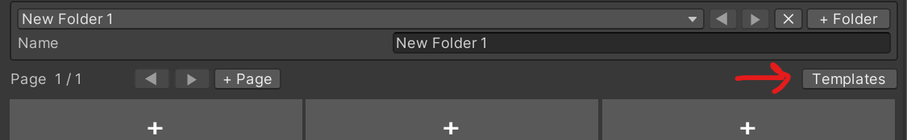
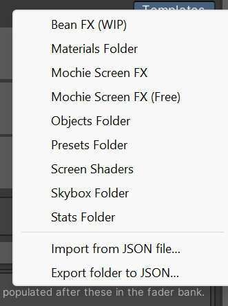
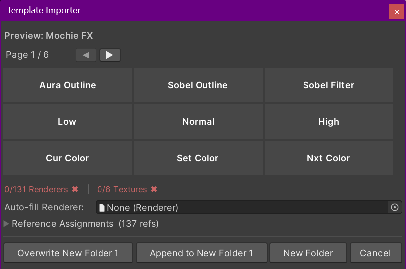
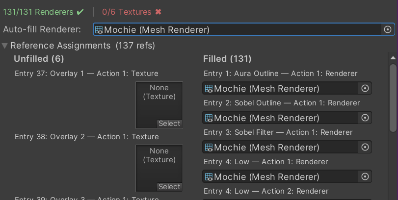
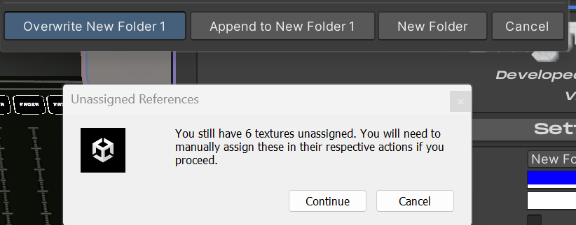

# Template System

Templates allow importing or exporting folders. Basic templates are
included for various use cases and shader sets. To get started with
templates, click the “Templates” button.

This opens a menu to choose which template to import, or to export the
current folder as a template. Saving a template JSON to the “Templates”
folder under the “Enigma OS” folder will add your new template to this
list.

Basic templates include:

- Objects Folder: A page of object toggles, for toggling the active
  state of objects.

- Materials Folder: A page of material toggles, for swapping materials
  on a renderer.

- Skybox Folder: A page of skybox toggles with an auto-change button,
  for changing the skybox in your scene.

- Stats Folder: A page of stats displays, for viewing stats about your
  world. Can pull stats directly from the VRChat API like total visits.

- Presets Folder: Allows saving the current state of the controller as a
  preset. Includes save, load and clear buttons, and 24 blank preset
  slots. Presets are persistent and save to the PlayerData, allowing
  each user to make their own and load them when using the controller.
  More on that in [Using Presets](presets.md).

- Screen Shaders: This folder allows launching screen shaders configured
  on separate materials using templated renderers. See [Screen Shader Setup](screen-shaders.md).

- Mochie, Bean FX, etc: These templates are specific to various shader
  sets. You must have these shaders imported to use them. See [Screen Shader Setup](screen-shaders.md).

More templates may be added later, so this list might not be exhaustive.

Clicking on a template in the menu will open the Template Importer. This
is where you can preview the buttons to be imported, and assign
references if required.

Use the arrow keys to navigate pages in the preview. The Reference
Assignments foldout lets you assign the references like renderers,
textures, etc. If you do not assign these, you will need to do so in the
individual button actions.

Use the Auto-fill Renderer field to quickly assign all renderer fields
with the chosen renderer. This is useful for shader set templates, where
these are intended to use a single renderer. Filled references move to
the right side, so you can see on the left what remains to be assigned.

When you are finished, click one of the buttons to import the template.
Overwrite will replace the currently selected folder. Append will add
the template buttons to the current folder, keeping any currently
configured buttons. New folder will import it as a new folder. If you
try to import with unassigned references, a warning will pop-up.

Note: Templates are great for learning how to make your own layouts! You
can copy/paste buttons from a template into your own custom folder.

[← Using Prefabs](using-prefabs.md) | [Screen Shader Setup →](screen-shaders.md)
