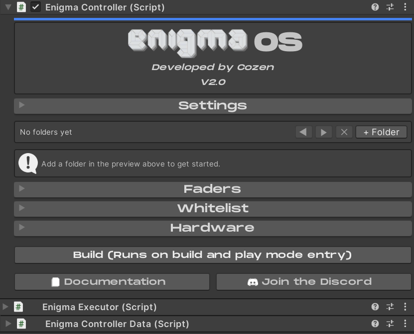
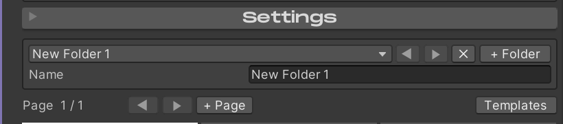
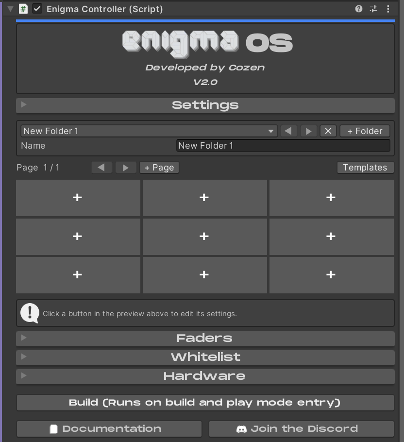
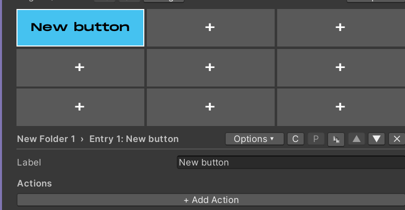
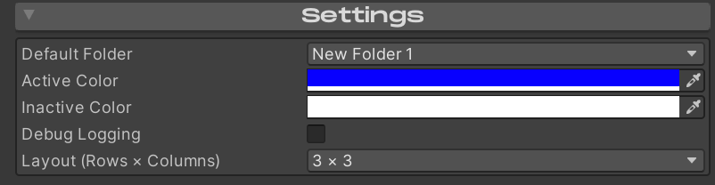
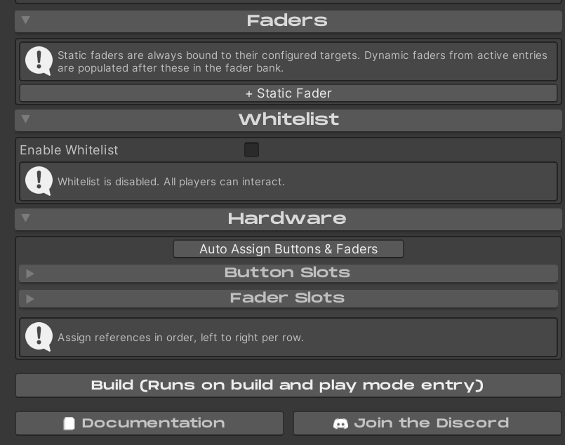

# Using Enigma OS

After importing and adding one of the prefabs to your scene, click on
the prefab to start using Enigma OS.

This editor is where you will do all your configuration. To begin, click
the “+ Folder” button.

You will see a new folder populated. You can change the name to whatever
you desire. You can make as many folders as you want. Use the dropdown
to re-order the folders or select which folder to edit. You can also
navigate folders using the arrow buttons. The X button deletes the
currently selected folder.

You will also see the Button Grid appear. To edit a button in your
folder, click on one of these slots. You can also add or navigate
between pages using the arrow keys and “+ Page” button. The Templates
button allows importing/exporting a folder, see [Template System](templates.md).
Basic templates are included for many use cases and shader sets.

Doing so will make a new button, you can change the name to whatever you
want.

To configure what the selected button does, add an action with “+ Add
Action”. This will show a list of all available actions. For details on
what each action does, see [Actions Overview](actions.md).

Each button can also be configured with additional options using the
“Options” dropdown. These are covered in [Advanced Features](advanced.md) and
[Faders](faders.md).

The C and P buttons allow copying and pasting buttons to a different
button slot on your controller, even across different folders. The
duplicate button makes a duplicate of the selected button on the next
empty slot in the current folder. The arrow keys allow quickly switching
to the next/previous button in the folder. The X button deletes the
currently selected button.

At the top of Enigma OS is a Settings foldout. Here you can choose the
default folder that is shown when your world is launched. “Active Color”
and “Inactive Color” are the default colors used for the buttons in the
“On” and “Off” state. Debug Logging should be left disabled unless
you’re trying to make a bug report of any issue, it is very noisy.
Layout controls the layout of the Button Grid. This shouldn’t be changed
unless you’re making a custom controller, see [Making Custom Controllers](custom-controllers.md).

The Faders foldout is where you can configure static faders. See [Using Faders](faders.md).

The Whitelist foldout is where you can configure access control. See
[Whitelist (Access Control)](whitelist.md).

The Hardware foldout is where you can add more buttons or faders. The
prefabs are already wired, so this is only useful for [Making Custom Controllers](custom-controllers.md) or re-assigning the references if you happen to “Reset”
the entire editor script.

The Build button allows you to quickly set the scene to your configured
default state. It’s not required to click this after every change,
Enigma OS will call Build on play mode entry and when building your
world through the VRChat SDK.

Lastly, you can quickly open these docs using the Documentation button
or join the Enigma Discord for support or questions.

[← Installation](installation.md) | [Using Prefabs →](using-prefabs.md)
