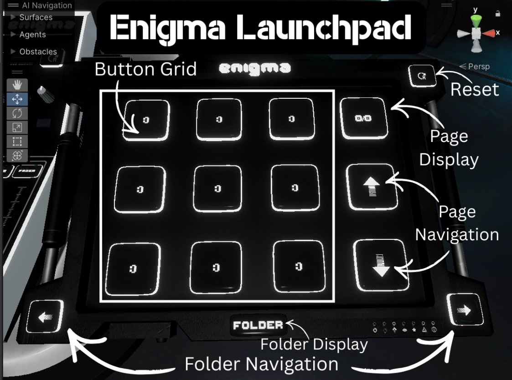

# Using Prefabs

Both the Launchpad and Mixer run on Enigma OS. The only difference is
the Mixer adds 9 customizable faders, a screen with a built-in AudioLink
controller, screen texture, and waveform display, and additional buttons
for fader control or hotkeys. The “Alternate Fader Control” button
switches between hand collider control and VRC pickup control, allowing
manipulation of the faders in play mode or on Desktop.

You can use more than one controller in the same scene, but you can only
ever have one AudioLink controller! Make sure you delete any existing
AudioLink controller, or remove the one under the “Screen” child object
of the Mixer prefab.

---

**Navigation:** [Introduction](index.md) · [Installation](installation.md) · [Using Enigma OS](using-enigma-os.md) · [Using Prefabs](using-prefabs.md) · [Template System](templates.md) · [Screen Shader Setup](screen-shaders.md) · [Actions Overview](actions.md) · [Using Faders](faders.md) · [Using Presets](presets.md) · [Advanced Features](advanced.md) · [Whitelist (Access Control)](whitelist.md) · [Standalone Buttons](standalone-buttons.md) · [Custom Controllers](custom-controllers.md)

[← Using Enigma OS](using-enigma-os.md) | [Template System →](templates.md)
