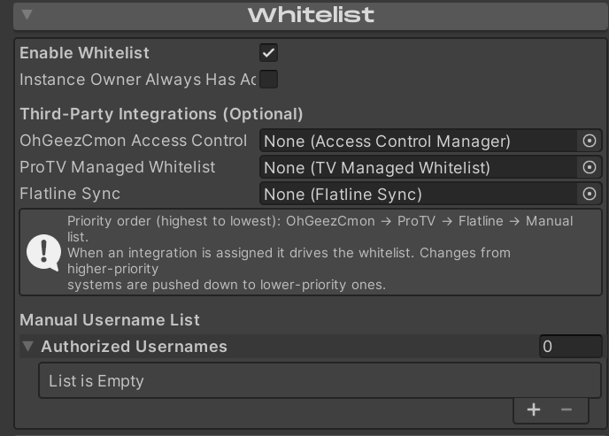

# Whitelist (Access Control)

Enigma OS supports whitelisting users through a manual username list or
various third party integrations. Supply usernames in the Manual
Username List (case insensitive). If desired, add a reference to a third
party integration. If one is supplied, Enigma OS will use that whitelist
instead, using the manual list ONLY in the case that it fails to pull
the whitelist from the third party whitelist, which would be unusual.

Enigma OS supports OhGeezCmon Access Control, ProTV Managed Whitelists,
and Flatline Sync. The download links for these are in [Installation and Dependencies](installation.md). If you assign multiple references, Enigma OS will
keep the whitelists in sync by pushing changes to the other systems. The
higher priority system acts as the source of truth, but in practice no
matter which ones you assign they should all remain in sync. For
example, if you assign ProTV Managed Whitelist and Flatline Sync, any
users you authorize in the ProTV managed whitelist will be able to
interact with Enigma OS as well as Flatline.

The whitelist also gates the syncing of the hand collider objects for
fader control.

[← Advanced Features](advanced.md) | [Standalone Buttons →](standalone-buttons.md)
